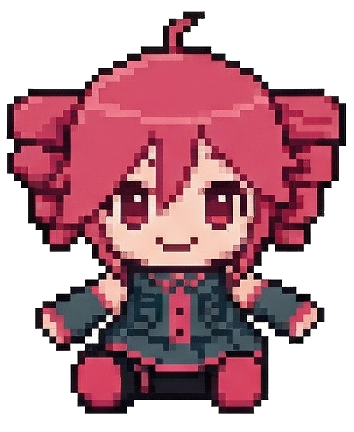
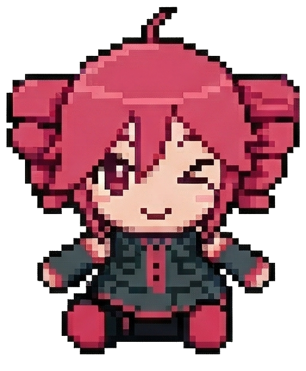
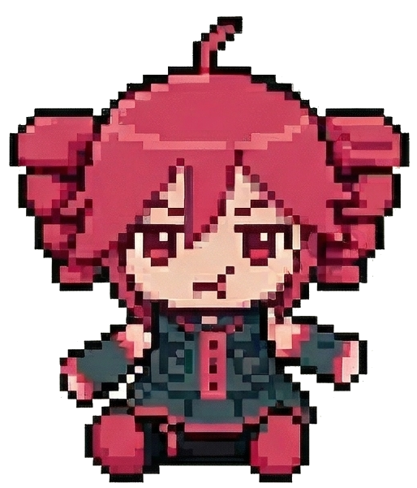
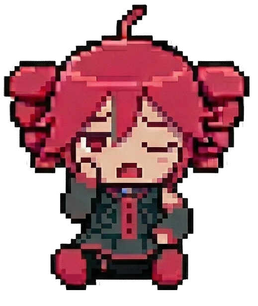
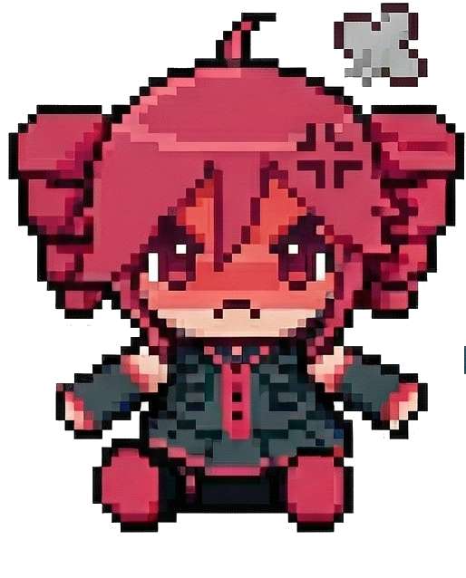
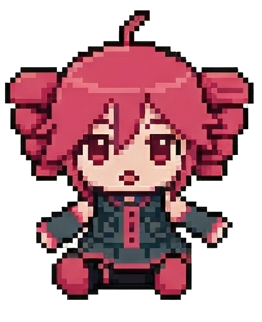
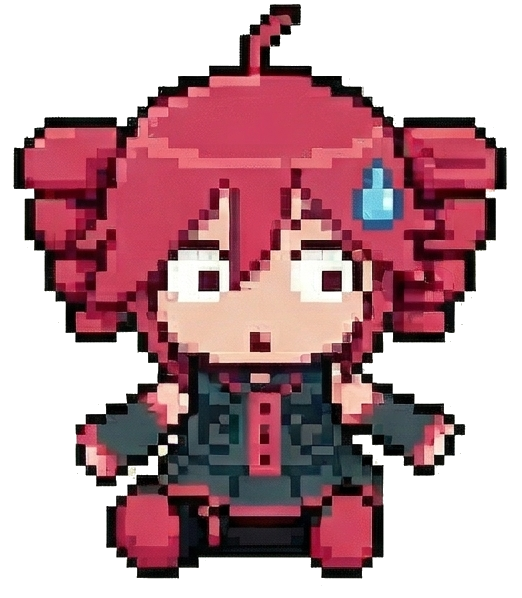
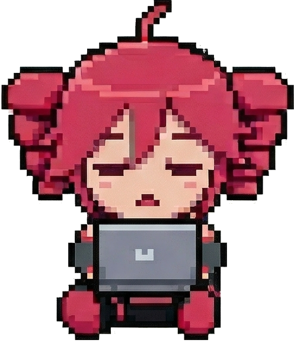
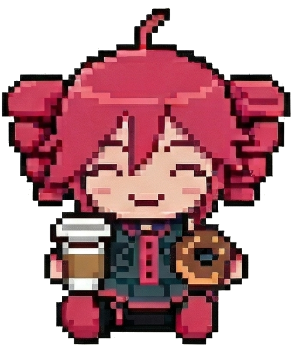
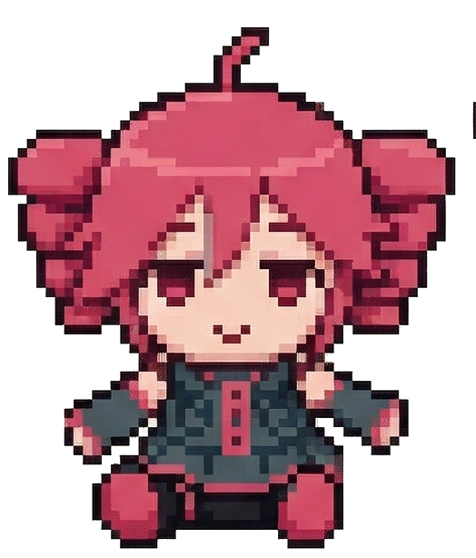

# Teto Companion

<p align="center">
  
</p>

<p align="center">
  A desktop AI companion that lives on your screen, watches what you're doing, and has opinions about it.
</p>

---

## What is this

Teto is a transparent, always-on-top desktop companion built with Electron + React. She sits in the corner of your screen, reacts to what she sees, talks to you when you message her, and generally makes herself at home.

She's powered by Claude for conversation, Fish Audio for her voice, and a small pile of hand-drawn sprites for her expressions.

## Features

- **Screen awareness** — she watches your screen and reacts to what's happening, unprompted
- **Voice** — synthesized speech via Fish Audio S2, with inline delivery tags for cadence
- **Voice input** — push-to-talk via mic button or hold `Ctrl+Space`
- **Chat** — type to her directly; she maintains conversation context
- **Web search** — ask her to look something up and she will, using Tavily
- **Game mode** — enable it and she pays closer attention while you play
- **Accessories** — put a hat on her
- **System tray** — she lives in the tray when you close the window; right-click to mute or quit
- **Idle animations** — she breathes, gets sleepy, yawns when you've left her alone too long

## Expressions

<p>
  
  
  
  
  
  
  
  
</p>

## Setup

### Prerequisites

- Node.js 18+
- An [Anthropic API key](https://console.anthropic.com) (required)
- A [Fish Audio](https://fish.audio) key + reference voice ID (optional — enables her voice)
- An [OpenAI API key](https://platform.openai.com) (optional — enables voice input via Whisper)
- A [Tavily API key](https://app.tavily.com) (optional — enables web search)

### Install & run

```bash
npm install
cp .env.example .env
# fill in your keys in .env
npm run dev
```

### Build

```bash
npm run package
```

Produces a portable `.exe` in `release/`.

## Configuration

All settings are available in the in-app Settings window (⚙ button, or right-click tray → Settings). Keys entered there are saved locally and take precedence over `.env`.

| Setting | Description |
|---|---|
| Reaction rate | How often Teto comments on your screen unprompted |
| Screen sensitivity | How much change triggers a reaction |
| Game mode intensity | How dramatically she reacts while you play |
| Window opacity | Transparency of the overlay |
| Always on top | Whether she stays above other windows |
| Resizable window | Allow dragging the window edge to resize |
| Launch on startup | Start with Windows |

## Adding accessories

Drop a PNG into `public/sprites/` and add an entry to `src/hats.js`:

```js
{ id: 'myhat', name: 'My Hat', file: 'myhat.png', top: 25, width: 160 }
```

`top` is the vertical offset from the top of the avatar (in px). `width` is display width. Tune until it sits right.

## Hotkeys

| Shortcut | Action |
|---|---|
| `Ctrl+Shift+M` | Toggle mute |
| `Ctrl+Space` (hold) | Push to talk |

## Stack

- **Electron 33** — desktop shell
- **React 18 + Vite** — renderer
- **Claude (Anthropic)** — conversation and screen reactions
- **Fish Audio S2** — voice synthesis
- **OpenAI Whisper** — voice transcription
- **Tavily** — web search

---

<p align="center">
  
  <br/>
  <sub>she's not impressed, but she's here</sub>
</p>
